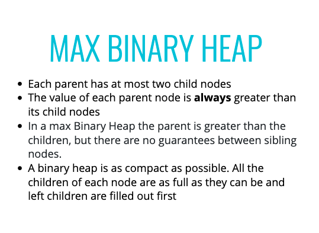

# Binary Heaps

## Max Binary Heap
Parent node is ALWAYS greater than its children, that is the only condition
No Order
Largest node is at the root

## Min Binary Heap
Parent node is ALWAYS smaller than its children, that is the only condition
No Order
Smallest node is at the root

## Removing
Usually remove from the root
ie Max Binary Heap removes max value @ root
ie Min Binary Heap removes min value @ root




### Max Binary Heap
```
class MaxBinaryHeap {
    constructor() {
        this.values = [];
    }

    insert(val) {
        this.values.push(val);
        this.bubbleUp()
    }

    bubbleUp() {
        let idx = this.values.length - 1;
        let elm = this.values[idx];
        while (idx > 0) {
            let parentIdx = Math.floor((idx - 1 / 2));
            let parent = this.values[parentIdx];
            if(elm <= parent) break
            this.values[parentIdx] = elm;
            this.values[idx] = parent;
            idx = parentIdx;
        }
    }

    extractMax() {
        let max = this.values[0];
        let end = this.values.pop();
        if(this.values.length > 0) {
            this.values[0] = end;
            this.bubbleDown();
        }
        return max;
    }

    bubbleDown() {
        let idx = 0;
        let length = this.values.length;
        let element = this.values[0];
        while(true) {
            let leftChildIdx = 2 * idx + 1;
            let rightChildIdx = 2 * idx + 2;
            let leftChild, rightChild;
            let swap = null;

            if(leftChildIdx < length) {
                leftChild = this.values[leftChildIdx];
                if (leftChild > element) {
                    swap = leftChildIdx;
                }
            }
            if(rightChildIdx < length) {
                rightChild = this.values[rightChildIdx];
                if ((swap === null && rightChild > element) || (swap !== null && rightChild > leftChild))  {
                    swap = rightChildIdx;
                }
            }
            if(swap === null) break;
            this.values[idx] = this.values[swap];
            this.values[swap] = element;
            idx = swap;
        }
    }
}

var binaryHeap = new MaxBinaryHeap();
```
