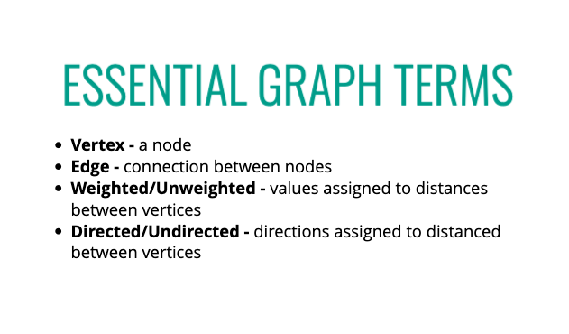
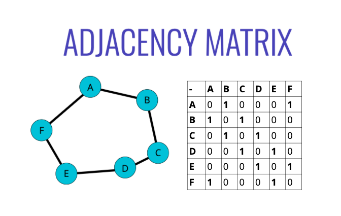
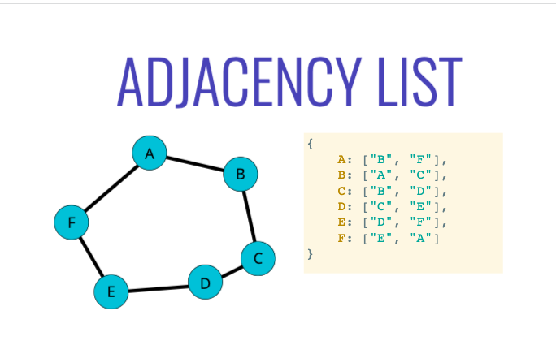
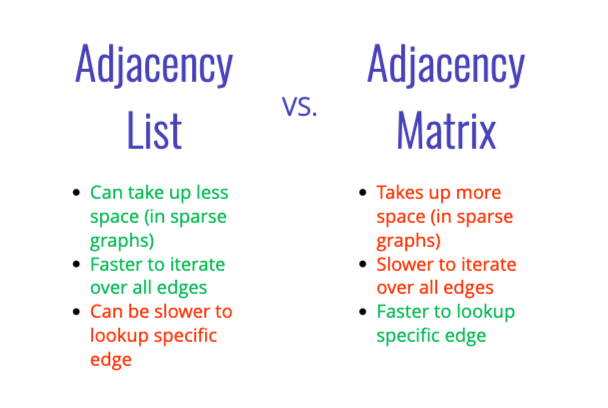
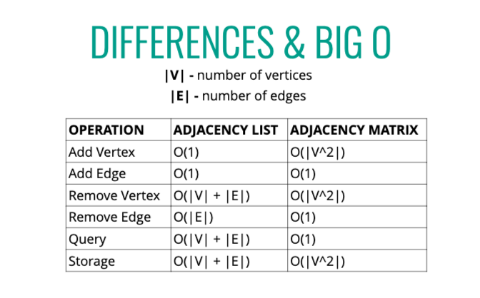

# Graphs















 - Adjacency Lists are used most often

 ```
 class Graph {
  constructor() {
    this.adjacencyList = {};
  }

  addVertex(vertex) {
    if (!this.adjacencyList[vertex]) {
      this.adjacencyList[vertex] = [];
    }
  }

  addEdge(vertex1, vertex2) {
    // add checks for valid keys
    this.adjacencyList[vertex1].push(vertex2);
    this.adjacencyList[vertex2].push(vertex1);
  }

  removeEdge(vertex1, vertex2) {
    this.adjacencyList[vertex1] = this.adjacencyList[vertex1].filter(
      v => v !== vertex2
    )
    this.adjacencyList[vertex2] = this.adjacencyList[vertex2].filter(
      v => v !== vertex1
    )
  }

  removeVertex(vertex) {
    for (let i = 0; i < this.adjacencyList[vertex].length; i++) {
      this.removeEdge(vertex, this.adjacencyList[vertex][i])
    }
    delete this.adjacencyList[vertex]
  }
}

let graph = new Graph();
graph.addVertex("Boston");
graph.addVertex("NYC");
graph.addVertex("Tokyo");
graph.addEdge("Boston", "NYC");
graph.addEdge("NYC", "Tokyo");


```

# Graph Traversal

```
class Graph {
  constructor() {
    this.adjacencyList = {};
  }

  addVertex(vertex) {
    if (!this.adjacencyList[vertex]) {
      this.adjacencyList[vertex] = [];
    }
  }

  addEdge(vertex1, vertex2) {
    // add checks for valid keys
    this.adjacencyList[vertex1].push(vertex2);
    this.adjacencyList[vertex2].push(vertex1);
  }

  removeEdge(vertex1, vertex2) {
    this.adjacencyList[vertex1] = this.adjacencyList[vertex1].filter(
      v => v !== vertex2
    )
    this.adjacencyList[vertex2] = this.adjacencyList[vertex2].filter(
      v => v !== vertex1
    )
  }

  removeVertex(vertex) {
    for (let i = 0; i < this.adjacencyList[vertex].length; i++) {
      this.removeEdge(vertex, this.adjacencyList[vertex][i])
    }
    delete this.adjacencyList[vertex]
  }

  dfsResursive(start) {
    let results = [];
    let visited = {};
    let adjacencyList = this.adjacencyList;

    function dfs(vertex) {
      if (!vertex) return null;
      visited[vertex] = true;
      results.push(vertex);
      adjacencyList[vertex].forEach(neighbor => {
        if (!visited[neighbor]) {
          return dfs(neighbor)
        }
      })
    }
    dfs(start)
    return results;
  }

  dfsIterative(start) {
    let stack = [start];
    let result = [];
    let visited = {};
    let currentVertex;

    while (stack.length) {
      currentVertex = stack.pop();
      result.push(currentVertex);

      this.adjacencyList[currentVertex].forEach(x => {
        if(!visited[x]) {
          visited[x] = true;
          stack.push(x);
        }
      })
    }
    return result;
  }

  bfs(start) {
    let queue = [start];
    let result = [];
    let visited = {};
    let currentVertex;
    visited[start] = true;

    while(queue.length) {
      currentVertex = queue.shift();
      result.push(currentVertex);
      this.adjacencyList[currentVertex].forEach(x => {
        if(!visited[x]) {
          visited[x] = true;
          queue.push(x);
        }
      })
    }
    return result;
  }
}

let graph = new Graph();
graph.addVertex("A");
graph.addVertex("B");
graph.addVertex("C");
graph.addVertex("D");
graph.addVertex("E");
graph.addVertex("F");

graph.addEdge("A", "B");
graph.addEdge("A", "C");
graph.addEdge("B", "D");
graph.addEdge("C", "E");
graph.addEdge("D", "E");
graph.addEdge("D", "F");
graph.addEdge("E", "F");

```


## Weighted Graph w/ PQ
```
class PriortyQueue {
  constructor() {
    this.values = [];
  }

  enqueue(val, priority) {
    this.values.push({val, priority});
    this.sort();
  }

  dequeue() {
    return this.values.shirt();
  }

  sort() {
    this.values.sort((a,b) => a.priority - b.priority)
  }
}

class WeightedGraph {
    constructor() {
        this.adjacencyList = {};
    }

  addVertex(vertex) {
    if (!this.adjacencyList[vertex]) {
      this.adjacencyList[vertex] = [];
    }
  }

  addEdge(vertex1, vertex2, weight) {
    // add checks for valid keys
    this.adjacencyList[vertex1].push({node: vertex2, weight});
    this.adjacencyList[vertex2].push({node: vertex1, weight});
  }

  removeEdge(vertex1, vertex2) {
    this.adjacencyList[vertex1] = this.adjacencyList[vertex1].filter(
      v => v !== vertex2
    )
    this.adjacencyList[vertex2] = this.adjacencyList[vertex2].filter(
      v => v !== vertex1
    )
  }

  removeVertex(vertex) {
    for (let i = 0; i < this.adjacencyList[vertex].length; i++) {
      this.removeEdge(vertex, this.adjacencyList[vertex][i])
    }
    delete this.adjacencyList[vertex]
  }

  dfsResursive(start) {
    let results = [];
    let visited = {};
    let adjacencyList = this.adjacencyList;

    function dfs(vertex) {
      if (!vertex) return null;
      visited[vertex] = true;
      results.push(vertex);
      adjacencyList[vertex].forEach(neighbor => {
        if (!visited[neighbor]) {
          return dfs(neighbor)
        }
      })
    }
    dfs(start)
    return results;
  }

  dfsIterative(start) {
    let stack = [start];
    let result = [];
    let visited = {};
    let currentVertex;

    while (stack.length) {
      currentVertex = stack.pop();
      result.push(currentVertex);

      this.adjacencyList[currentVertex].forEach(x => {
        if(!visited[x]) {
          visited[x] = true;
          stack.push(x);
        }
      })
    }
    return result;
  }

  bfs(start) {
    let queue = [start];
    let result = [];
    let visited = {};
    let currentVertex;
    visited[start] = true;

    while(queue.length) {
      currentVertex = queue.shift();
      result.push(currentVertex);
      this.adjacencyList[currentVertex].forEach(x => {
        if(!visited[x]) {
          visited[x] = true;
          queue.push(x);
        }
      })
    }
    return result;
  }
}

let wGraph = new WeightedGraph();
wGraph.addVertex("A");
wGraph.addVertex("B");
wGraph.addVertex("C");
wGraph.addVertex("D");
wGraph.addVertex("E");
wGraph.addVertex("F");

wGraph.addEdge("A", "B", 4);
wGraph.addEdge("A", "C", 6);
wGraph.addEdge("B", "D", 1);
wGraph.addEdge("C", "E", 1);
wGraph.addEdge("D", "E", 9);
wGraph.addEdge("D", "F", 5);
wGraph.addEdge("E", "F", 3);

```
