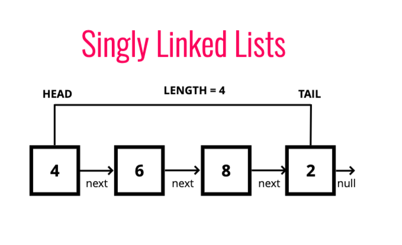

# SinglyLinkedList



```
class Node {
    constructor(val) {
        this.val = val;
        this.next = null;
    }
}

class SinglyLinkedList {
    constructor() {
        this.head = null;
        this.tail = null;
        this.length = 0;
    }

    push(val) {
        let newNode = new Node(val);
        if(!this.head) {
            this.head = newNode;
            this.tail = newNode
        } else {
            this.tail.next = newNode;
            this.tail = newNode;
        }
        this.length++;
        return this;
    }

    pop() {
        if(!this.head) return undefined;
        let current = this.head;
        let newTail = current;
        while (current.next) {
            newTail = current;
            current = current.next;
        }
        this.tail = newTail;
        this.tail.next = null;
        this.length--;
        if(this.length == 0) {
            this.head = null;
            this.tail = null;
        }
        return current;
    }

    shift() {
        if(!this.head) return undefined;
        var removedHead = this.head;
        this.head = removedHead.next;
        this.length--;
        if(this.length === 0) {
            this.tail = null;
        }
        return removedHead;
    }

    // Add to list at head
    unshift(val) {
        let newNode = new Node(val);
        if(!this.head) {
            this.head = newNode;
            this.tail = newNode;
        } else {
            newNode.next = this.head;
            this.head = newNode;
        }
        this.length++;
        return this;
    }

    get(index) {
        if(index < 0 || index >= this.length) return null;
        let counter = 0;
        let temp = this.head;
        while(counter !== index) {
            temp = temp.next;
            counter++;
        }
        return temp;
    }

    set(index, val) {
        let node = this.get(index);
        if(!node) return false;
        node.val = val;
        return true;
    }

    insert(index, val) {
        if(index < 0 || index > this.length) return false;
        if(index === this.length) {
            this.push(val);
            return true;
        }
        if(index === 0) {
            this.unshift(val);
            return true;
        }

        let newNode = new Node(val);
        newNode.next = this.get(index - 1).next;
        this.get(index - 1).next = newNode;
        length++;
        return true;
    }

    remove(index) {
        if(index < 0 || index >= this.length) return undefined
        if(index === this.length - 1) return this.pop()
        if(index === 0) return this.shift()

        let temp = this.get(index - 1);
        let removed = this.get(index);
        temp.next = removed.next;
        this.length--;
        return removed;
    }

    reverse() {
        let node = this.head;
        this.head = this.tail;
        this.tail = node;
        let prev = null;
        let next = null;
        for(let i = 0; i < this.length; i++) {
            next = node.next;
            node.next = prev;
            prev = node;
            node = next;
        }
        return this;
    }
}

var list = new SinglyLinkedList();
list.push(1)
list.push(10)
list.push(50)
list.push(100)
```


