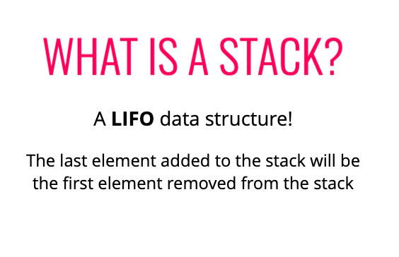
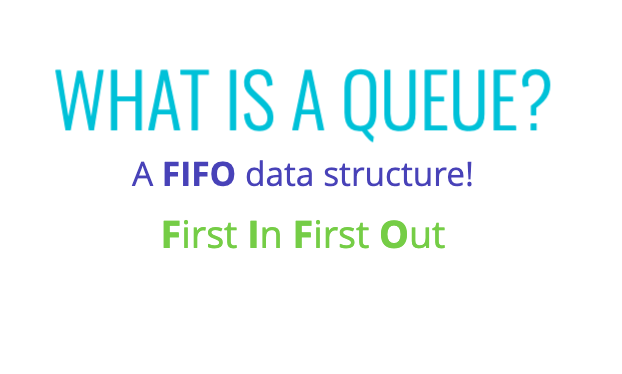
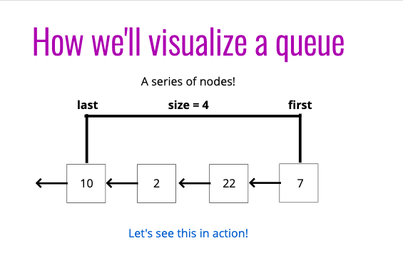

# Stacks
 - Use an `array` with `push` / `pop` for quick implementation
 - Use Singly Linked List for official implementation




 ```
 class Node {
    constructor(value) {
        this.value = value;
        this.next = null;
    }
}
class Stack {
    constructor() {
        this.first = null;
        this.last = null;
        this.size = 0;
    }

    push(val) {
        let newNode = new Node(val);
        if(!this.first) {
            this.first = newNode;
            this.last = newNode;
        } else {
            let temp = this.first;
            this.first = newNode;
            this.first.next = temp;
        }
        return ++this.size;
    }

    pop() {
        if(!this.first) return null;
        let temp = this.first;
        if(this.first === this.last){
            this.last = null;
        }
        this.first = this.first.next;
        this.size--;
        return temp.value;
    }
}
var stack = new Stack();
```

# Queues






 - Use an `array` with `unshift` and `pop`
 OR
 - Use an `array` with `shift` and `push`
  - Both work but will one will need to iterate whole list

  ```
  class Node {
    constructor(value) {
        this.value = value;
        this.next = null;
    }
}

class Queue {
    constructor() {
        this.first = null;
        this.last = null;
        this.size = 0;
    }

    enqueue(val) {
        let newNode = new Node(val);
        if(!this.first) {
            this.first = newNode;
            this.last = newNode;
        } else {
            this.last.next = newNode;
            this.last = newNode
        }
        return ++this.size;
    }

    dequeue() {
        if(!this.first) return null;
        let temp = this.first;
        if(this.first === this.last){
            this.last = null;
        }
        this.first = this.first.next;
        this.size--;
        return temp.value;
    }
}
var queue = new Queue()
 ```
