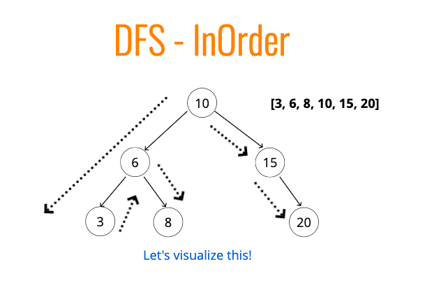

# Tree Traversal
 - Breadth First Search (BFS)
 - Depth First Search (DFS)
  - In Order
  - Pre Order
  - Post Order

Traversal Steps
 1. Visit the Node
 2. Traverse the left
 3. Traverse the right

## Pre Order
- Visit the Node
- Traverse the entire left
- Traverse the entire right

## Post Order
 - Traverse the entire left
 - Traverse the entire right
 - Visit the node
 - The root is the last visited

## In Order
 - Traverse the entire left side
 - Visit the node
 - Traverse the entire right side

## Which is better?
 - If tree is tall - use BFS. If wide - use DFS
 - DFS In Order will order data (1, 2, 3 etc)
 - DFS Pre Order - use for cloning / duplicating tree. Ordered to reconstruct

```
class Node {
    constructor(value) {
        this.value = value;
        this.left = null;
        this.right = null;
    }
}

class BinarySearchTree {
    constructor() {
        this.root = null;
    }

    insert(val) {
        let newNode = new Node(val);
        if (!this.root) {
            this.root = newNode
            return this;
        }
        let nodeToCheck = this.root
        while(nodeToCheck) {
            if (val === nodeToCheck.value) return undefined;
            if (val < nodeToCheck.value) {
                if (nodeToCheck.left) {
                    nodeToCheck = nodeToCheck.left;
                } else {
                    nodeToCheck.left = newNode;
                    return this;
                }
            }
            else if (val > nodeToCheck.value) {
                if (nodeToCheck.right) {
                    nodeToCheck = nodeToCheck.right;
                } else {
                    nodeToCheck.right = newNode;
                    return this;
                }
            }
        }
    }

    contains(val) {
        if (!this.root) return false
        let nodeToCheck = this.root
        let found = false;
        while(nodeToCheck && !found) {
            if(val < nodeToCheck.value) {
                nodeToCheck = nodeToCheck.left
            } else if (val > nodeToCheck.value) {
                nodeToCheck = nodeToCheck.right
            } else {
                return true;
            }
        }
        return false;
    }

    find(val) {
        if (!this.root) return false
        let nodeToCheck = this.root
        let found = false;
        while(nodeToCheck && !found) {
            if(val < nodeToCheck.value) {
                nodeToCheck = nodeToCheck.left
            } else if (val > nodeToCheck.value) {
                nodeToCheck = nodeToCheck.right
            } else {
                found = true;
            }
        }
        if(!found) return false;
        return nodeToCheck;
    }

    BFS() {
        let queue = [];
        let visited = [];
        queue.push(this.root)
        while(queue.length) {
            let x = queue.shift();
            visited.push(x);
            if(x.left) queue.push(x.left);
            if(x.right) queue.push(x.right);
        }
        return visited;
    }

    DSFPreOrder() {
        let visited = [];
        let current = this.root;
        function traversal(node) {
            if (!node) return;
            // 1. Visit Node (order is signifigant)
            visited.push(node)
            // 2. Check entire left side
            if (node.left) traversal(node.left);
            // 3. Check entire right side
            if (node.right) traversal(node.right);
        }
        traversal(current);
        return visited;
    }

    DFSPostOrder() {
        let visited = [];
        let current = this.root;
        function traversal(node) {
            if (!node) return;
            // 1. Check entire left side
            if (node.left) traversal(node.left);
            // 2. Check entire right side
            if (node.right) traversal(node.right);
            // 3. Visit Node (order is signifigant)
            visited.push(node)
        }
        traversal(current);
        return visited;
    }

    DFSInOrder() {
        let visited = [];
        let current = this.root;
        function traversal(node) {
            if (!node) return;
            // 1. Check entire left side
            if (node.left) traversal(node.left);
            // 2. Visit Node (order is signifigant)
            visited.push(node)
            // 3. Check entire right side
            if (node.right) traversal(node.right);
        }
        traversal(current);
        return visited;
    }
}

var tree = new BinarySearchTree();
tree.insert(10)
tree.insert(6)
tree.insert(3)
tree.insert(8)
tree.insert(15)
tree.insert(20)
```



