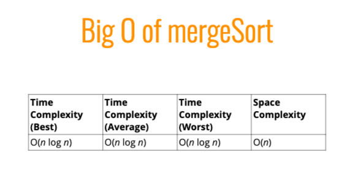
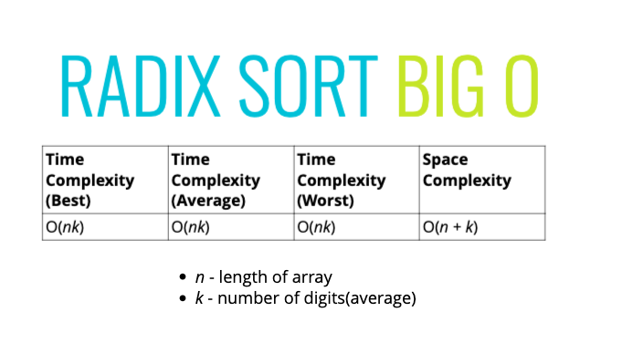

# Intermediate Sorting

## Quick Sort

- Uses a pivot and a pivot helper
- Pivot picking DOES matter, (ideally it is the median) but that is the point of Sorting
- Can use first or last index
- <strong>The pivot</strong> shifts all lower numers to front of array, at very end, swap first element so all elements less than are on the left side


The Pivot Helper


TODO@JS: Replace the two swaps with a swap function

```
function pivotHelper(arr, start=0, end=arr.length-1) {
    let pivot = arr[start];
    let pivotIndex = start;

    for (let i = start + 1; i < arr.length; i++) {
        if (pivot > arr[i]) {
            pivotIndex++;
            let temp = arr[i];
            arr[i] = arr[pivotIndex]
            arr[pivotIndex] = temp;
        }
    }
    let temp = arr[start];
    arr[start] = arr[pivotIndex]
    arr[pivotIndex] = temp;
    return pivotIndex;
}

let arrParam = [4, 8, 2, 1, 5, 7, 6, 3]

pivotHelper(arrParam)
```

Full Quick Sort implementation


```
function pivotHelper(arr, start=0, end=arr.length-1) {
   let pivot = arr[start];
   let pivotIndex = start;

   for (let i = start + 1; i < arr.length; i++) {
       if (pivot > arr[i]) {
           pivotIndex++;
           let temp = arr[i];
           arr[i] = arr[pivotIndex]
           arr[pivotIndex] = temp;
       }
   }
   let temp = arr[start];
   arr[start] = arr[pivotIndex]
   arr[pivotIndex] = temp;
   return pivotIndex;
}

function quickSort(arr, left = 0, right = arr.length - 1) {
   if (left < right) {
       let pivotIndex = pivotHelper(arr, left, right)
       //left
       quickSort(arr, left, pivotIndex - 1);
       //right
       quickSort(arr, pivotIndex + 1, right);
   }
   return arr;
}

quickSort([4, 8, 2, 1, 5, 7, 6, 3])
```


## Merge Sort

 - Break array into single item ( [x] ) arrays
 - Uses a helper function to merge two sorted arrays

 

 


 The Merge:

 ```
 function mergeArray(arr1, arr2) {
     let result = [];
     let i = 0;
     let j = 0;
     while (i < arr1.length && j < arr2.length){
         if(arr1[i] < arr2[j]){
             result.push(arr1[i]);
             i++;
         } else {
             result.push(arr2[j])
             j++
         }
         while(i < arr1.length) {
             result.push(arr1[i]);
             i++;
         }
         while(j < arr2.length) {
             result.push(arr2[j]);
             j++;
         }
     }
     return result;
 }

 mergeArray([2, 3, 7], [4, 6, 9, 10])
 ```

 

 Full Merge Sort implementation

 ```
 function mergeSort(arr) {
    if (arr.length <= 1) return arr
    let midPoint = Math.floor(arr.length / 2)
    let left = mergeSort(arr.slice(0, midPoint))
    let right = mergeSort(arr.slice(midPoint))
    return mergeArray(left, right)
}

 function mergeArray(arr1, arr2) {
     let result = [];
     let i = 0;
     let j = 0;
     while (i < arr1.length && j < arr2.length){
         if(arr1[i] < arr2[j]){
             result.push(arr1[i]);
             i++;
         } else {
             result.push(arr2[j])
             j++
         }
         while(i < arr1.length) {
             result.push(arr1[i]);
             i++;
         }
         while(j < arr2.length) {
             result.push(arr2[j]);
             j++;
         }
     }
     return result;
 }

mergeSort([3, 34, 53, 2,6, 2, 99])
```



## Radix Sort


 - Only works with numbers
 - Non comparision Sorting
 - Exploits that information about the size number is encoded in the data
  - Looks at the right might digit first
  - Number of runs determined by number with most digits

Radix Helper Functions (3)

  ```
  function getDigit(num, place) {
    // counts from the right
    var x = num.toString();
    var i = x.length - place;
    var result = parseInt(x[i - 1])
    return result;
}

getDigit(54324, 0) //4

function digitCount(num) {
    // 0 indexed
    if (num < 0) num = Math.abs(num);
    var x = num.toString();
    return x.length;
}

digitCount(46573) // 5

function mostDigits(nums) {
    let result = 0;
    for(let i in nums) {
        result = Math.max(result, digitCount(nums[i]))
    }
    return result;
}

mostDigits([1, 33433, 33, 27, 42231343]) // 8
```

Full Radix Sort Implementation

```
function getDigit(num, place) {
    // counts from the right
    var x = num.toString();
    if (place >= x.length) return 0;
    var i = x.length - place;
    var result = parseInt(x[i - 1])
    return result;
}

// getDigit(54324, 0) //4

function digitCount(num) {
    // 0 indexed
    if (num < 0) num = Math.abs(num);
    var x = num.toString();
    return x.length;
}

// digitCount(46573) // 5

function mostDigits(nums) {
    let result = 0;
    for(let i in nums) {
        result = Math.max(result, digitCount(nums[i]))
    }
    return result;
}

// mostDigits([1, 33433, 33, 27, 42231343]) // 8

function radixSort(arr) {
    var numOfDigits = mostDigits(arr)
    for (let k=0; k < numOfDigits; k++){
        let temp = Array.from({length: 10}, () => [])
        for (let i=0; i < arr.length; i++){
            let x = getDigit(arr[i], k)
            temp[x].push(arr[i]);
        }
        arr = [].concat(...temp);
    }
    return arr
}

radixSort([23, 45, 55555, 6948, 32, 90, 0, 932])
```


