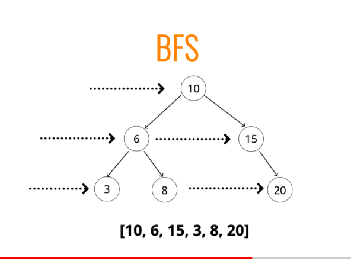
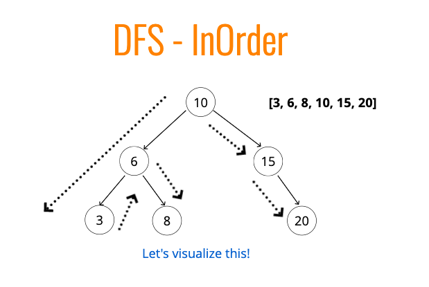
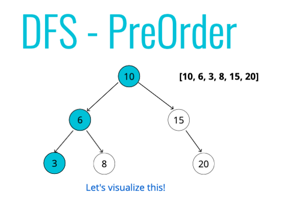
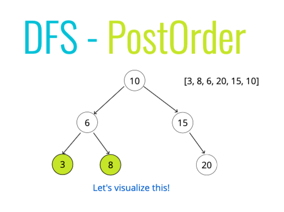

# Linked Lists

## Reverse List

https://leetcode.com/problems/reverse-linked-list/description/

```
var reverseList = function (head) {
    let prev = null;
    while (head != null) {
        let next = head.next;
        head.next = prev;
        prev = head;
        head = next;
    }
    return prev;
};
```

## Merge Lists

https://leetcode.com/problems/merge-two-sorted-lists/description/

```
var mergeTwoLists = function (list1, list2) {
    let prehead = new ListNode(-1);
    let prev = prehead;
    while (list1 != null && list2 != null) {
        if (list1.val <= list2.val) {
        prev.next = list1;
        list1 = list1.next;
    } else {
        prev.next = list2;
        list2 = list2.next;
    }
        prev = prev.next;
    }
    prev.next = list1 === null ? list2 : list1;
    return prehead.next;
};
```

# Trees

## Notes

### General

- Breadth First Search (BFS)
- Depth First Search (DFS)
- In Order
- Pre Order
- Post Order

Traversal Steps

1.  Visit the Node
2.  Traverse the left
3.  Traverse the right

### In Order

- Traverse the entire left side
- Visit the node
- Traverse the entire right side

### Pre Order

- Visit the Node
- Traverse the entire left
- Traverse the entire right

### Post Order

- Traverse the entire left
- Traverse the entire right
- Visit the node
- The root is the last visited

### Which is better?

- If tree is tall - use BFS. If wide - use DFS
- DFS In Order will order data (1, 2, 3 etc)
- DFS Pre Order - use for cloning / duplicating tree. Ordered to reconstruct

### Images









## BFS

```
function BFS() {
    let queue = [];
    let visited = [];
    queue.push(this.root)
    while(queue.length) {
        let x = queue.shift();
        visited.push(x);
        if(x.left) queue.push(x.left);
        if(x.right) queue.push(x.right);
    }
    return visited;
}
```

## DSFPreOrder

```
function DSFPreOrder() {
    let visited = [];
    let current = this.root;
    function traversal(node) {
        if (!node) return;
        // 1. Visit Node (order is signifigant)
        visited.push(node)
        // 2. Check entire left side
        if (node.left) traversal(node.left);
        // 3. Check entire right side
        if (node.right) traversal(node.right);
    }
    traversal(current);
    return visited;
}
```

## DFSPostOrder

```
function DFSPostOrder() {
    let visited = [];
    let current = this.root;
    function traversal(node) {
        if (!node) return;
        // 1. Check entire left side
        if (node.left) traversal(node.left);
        // 2. Check entire right side
        if (node.right) traversal(node.right);
        // 3. Visit Node (order is signifigant)
        visited.push(node)
    }
    traversal(current);
    return visited;
}
```

## DFSInOrder

```
function DFSInOrder() {
    let visited = [];
    let current = this.root;
    function traversal(node) {
        if (!node) return;
        // 1. Check entire left side
        if (node.left) traversal(node.left);
        // 2. Visit Node (order is signifigant)
        visited.push(node)
        // 3. Check entire right side
        if (node.right) traversal(node.right);
    }
    traversal(current);
    return visited;
}
```

### Find Max Depth

```
var isBalanced = function(root) {
    function getHeight(node) {
        if (!node) return 0

        let left = getHeight(node.left)
        let right = getHeight(node.right)

        if (left > right) return left + 1
        else return right + 1
    }
    getHeight(root)
};
```

### Compare Two Trees

```
function compareTrees(p, q) {
    if (!p && !q ) return true
    if (!p || !q) return false
    if (p.val !== q.val) return false
    return compareTrees(p.left, q.left) && compareTrees(p.right, q.right)
}
```

# Sorting

# Binary Search
```
function binarySearch(arr, val){
    let left = 0;
    let right = arr.length - 1;
    let middle = Math.floor((left + right) / 2);
    while (arr[middle] !== val && left <= right) {
        console.log(left, middle, right)
        if (val < arr[middle]) right = middle - 1;
        else left = middle + 1;
        middle = Math.floor((left + right) / 2);
    }
    return arr[middle] === val ? middle : -1
}
```
