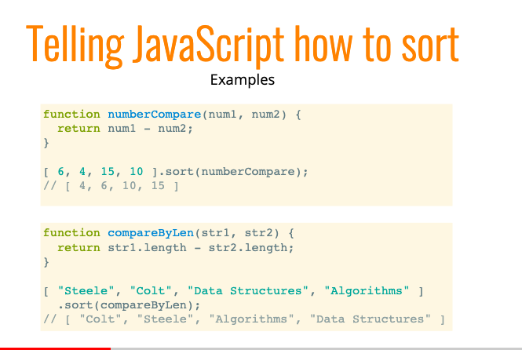
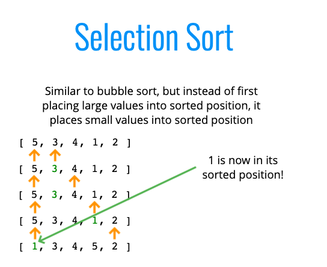

# Sorting

Video: https://www.youtube.com/watch?v=kPRA0W1kECg </br>
Animations: https://www.toptal.com/developers/sorting-algorithms

## Built in JS Sorting



## Swapping Method


### Naieve Bubble Sort code (optimized)

```
function bubbleSort(arr) {
    var noSwaps;
    //DOUBLE LOOP!
    for (let i = arr.length; i > 0; i--) {
        noSwaps = true;
        for (let j = 0; j < i - 1; j++) {
            //COMPARE!
            if (arr[j] > arr[j+1]) {
                //SWAP!
                let temp = arr[j];
                arr[j] = arr[j+1];
                arr[j+1] = temp;
                noSwaps = false;
            }
        }
        if(noSwaps) break;
    }
    return arr;
}
```

### Selection Sort

