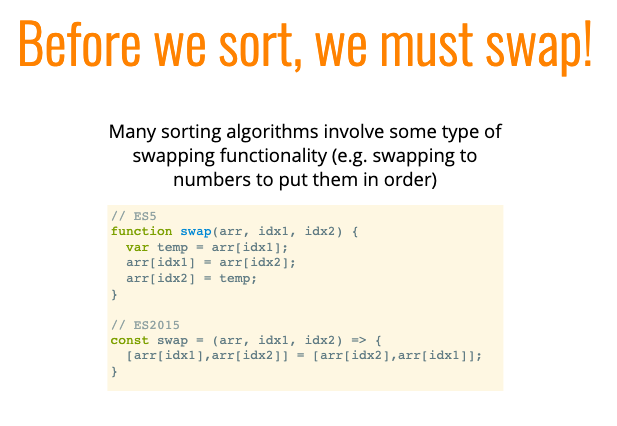
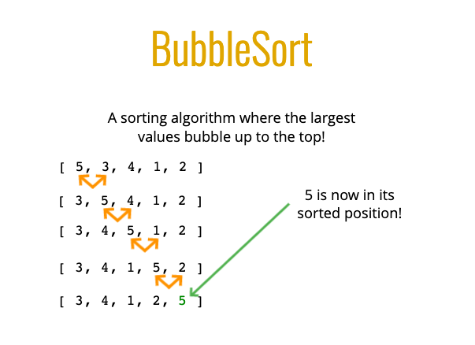
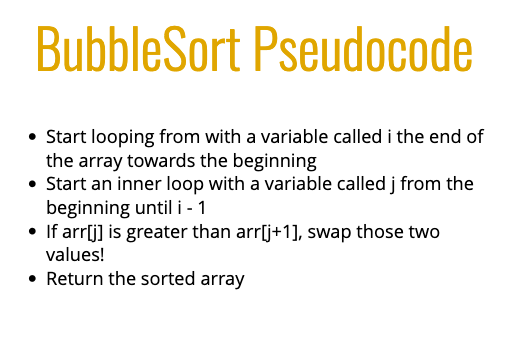
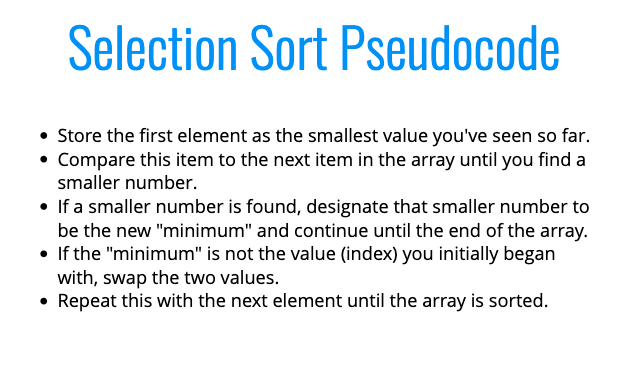
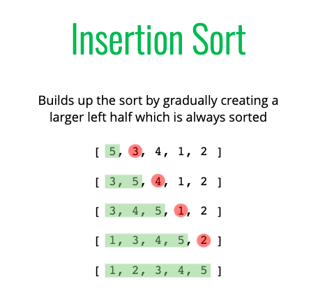
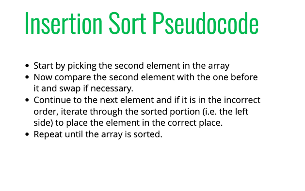

# Sorting
Video: https://www.youtube.com/watch?v=kPRA0W1kECg </br>
Animations: https://www.toptal.com/developers/sorting-algorithms

 - Elementary Sorting Algos:
  - Bubble Sorting
  - Selection Sorting
  - Insertion Sorting

 - All 3 algos loop over the array

## Built in JS Sorting


## Swapping Method


### Bubble Sort




```
function bubbleSort(arr) {
    var noSwaps;
    //DOUBLE LOOP!
    for (let i = arr.length; i > 0; i--) {
        noSwaps = true;
        for (let j = 0; j < i - 1; j++) {
            //COMPARE!
            if (arr[j] > arr[j+1]) {
                //SWAP!
                let temp = arr[j];
                arr[j] = arr[j+1];
                arr[j+1] = temp;
                noSwaps = false;
            }
        }
        if(noSwaps) break;
    }
    return arr;
}
```

### Selection Sort




 - Looks are current index and the one ahead, if lower it swaps them

 ```
 function selectionSort(arr) {
    for(let i = 0; i < arr.length; i++) {
        let min = i;
        for(let j = i + 1; j < arr.length; j++) {
            console.log(i, j)
            if (arr[j] < arr[min]) {
                min = j;
            }
        }
        if (i !=== min) {
          let temp = arr[i];
          arr[i] = arr[min];
          arr[min] = temp;
        }
    }
    return arr;
}
selectionSort([5, 20, 4, 6, 22, 13, 8, 3, 34])
```

## Insertion Sorting




 - Works well for scenarios where new data is coming in real time. Due to the fact the full left half is sorted, when a new data point is added, only one loop is required to insert into correct location

```
function insertionSort(arr){
var currentVal;
  for(var i = 1; i < arr.length; i++){
      currentVal = arr[i];
      for(var j = i - 1; j >= 0 && arr[j] > currentVal; j--) {
          arr[j+1] = arr[j]
      }
      arr[j+1] = currentVal;
  }
  return arr;
}

insertionSort([1, 2]);
```
